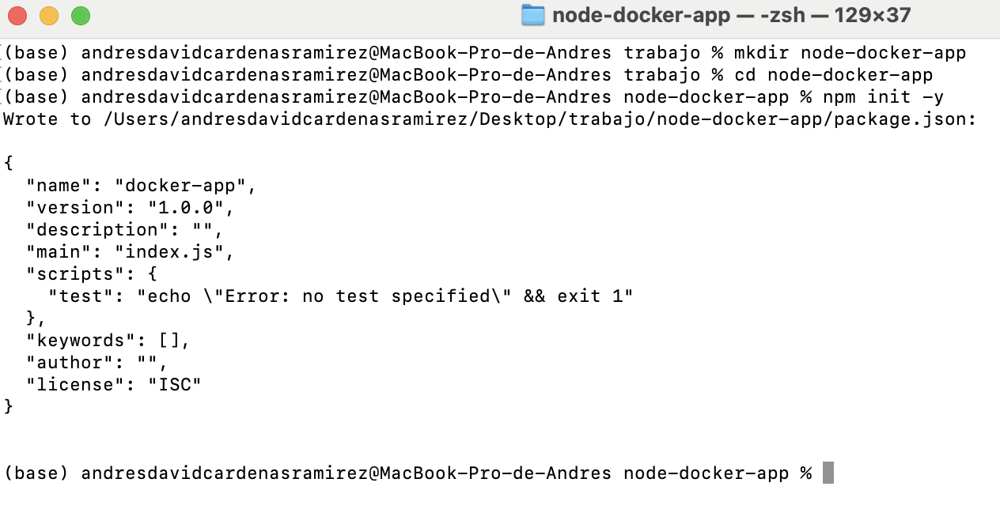
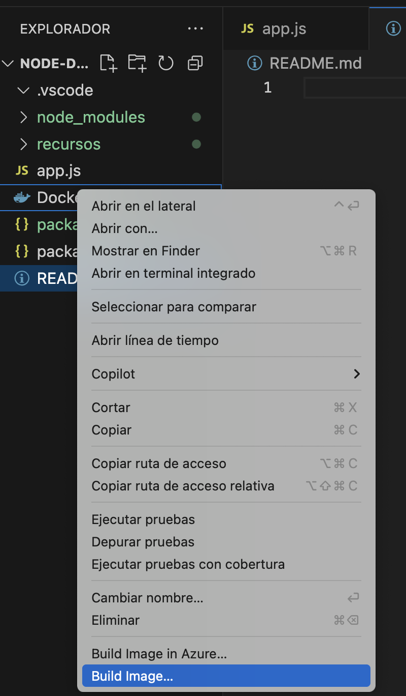
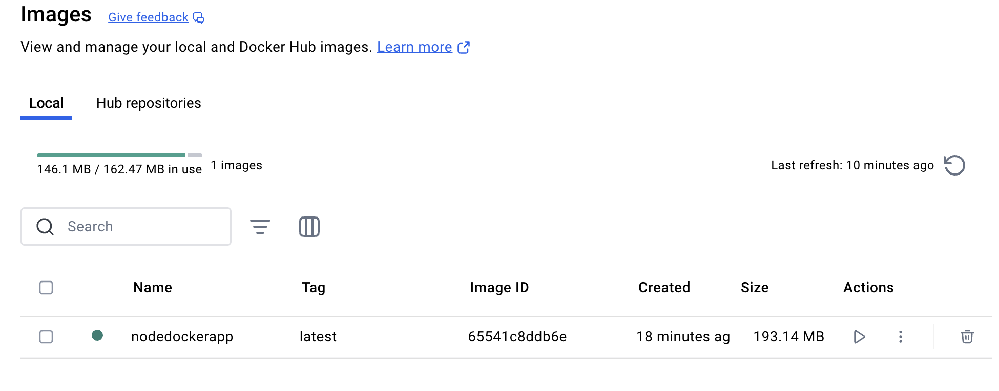
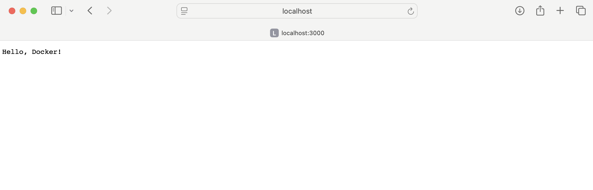

Pasos:

1. Primero seguimos los pasos para crear la carpeta del proyecto por la terminal

2. Luego creamos el app.js y el Dockerfile como se nos dice en las instrucciones 

3. Para construir la imagen de Docker podemos usar el comando que se nos da en las instrucciones o tambien podemos instalar la extension de Vscode de Docker que nos permite construir una imagen 

4. Luego de eso podemor ver desde Docker desktop que se tiene ya la imagen creada

5. Ya lo corremos y podemos ver el hello docker

